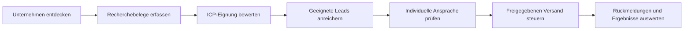

# Astra Sales Team

**Ein nachvollziehbarer Vertriebsprozess: Unternehmen finden, mit Belegen bewerten, individuelle Ansprache vorbereiten und Ergebnisse verfolgen.**

Das ist der Code zum Sales-Team-Projekt aus dem YouTube-Video. Du kannst das Dashboard mit fiktiven Daten ausprobieren, die Lead-Bewertung offline ausführen und das System anschließend mit deinen eigenen Daten und Diensten erweitern.

Der Kern ist ein austauschbares **ICP-Profil** (*Ideal Customer Profile*): Zielgruppe, Pflichtmerkmale, Signale und Ausschlüsse stehen in YAML. Die Recherche-Pipeline, die Versandsteuerung und das Dashboard sind davon getrennte Bausteine.



## In wenigen Minuten ausprobieren

Voraussetzungen: **Node.js 22 oder neuer**, npm und Git. Der Einstieg funktioniert unter Windows, macOS und Linux.

Unter Windows PowerShell verwende bei Befehlen mit zusätzlichen Optionen
`npm.cmd` statt `npm`, damit Argumente wie `--input` korrekt weitergegeben werden.
Die folgenden Shell-Beispiele verwenden die übliche Schreibweise `npm`.

```sh
git clone https://github.com/claes-work/astra-sales-team.git
cd astra-sales-team
npm ci
npm --prefix apps/dashboard ci
npm start
```

Öffne anschließend **[das lokale Dashboard](http://127.0.0.1:3210)**. Beim ersten Start kann die Oberfläche einen Moment zum Kompilieren brauchen.

Der Startbefehl öffnet eine lokale Demo mit fiktiven Firmen, Kontakten und Ereignissen. Die API läuft auf Port `8787`, das Dashboard auf Port `3210`. Du brauchst dafür keine Zugangsdaten, kein Appwrite und keinen E-Mail-Anbieter. Es werden keine E-Mails versendet. Der Demobestand liegt im Arbeitsspeicher; Änderungen gehen beim Neustart verloren. Mit `Ctrl+C` beendest du den Lauf.

Im Dashboard kannst du:

- Tageskennzahlen und die zugehörigen Aktivitäten ansehen.
- Firmen suchen, filtern und ihre Qualifizierung prüfen.
- Quellen, individuelle Entwürfe und den Nachrichtenverlauf öffnen.
- Rückmeldungen erfassen und Kontakte sperren.

Die Oberfläche enthält keinen Versandknopf. Versand wird im Backend gesondert konfiguriert und freigegeben.

## Was enthalten ist

| Baustein | Funktion |
| --- | --- |
| **Discovery** | Ein Google-Places-Adapter findet Firmenkandidaten. Eigene Discovery-Adapter lassen sich in die Pipeline einsetzen. |
| **ICP-Profile** | YAML-Profile beschreiben Märkte, Firmengrößen, Pflichtmerkmale, Signale, Ausschlüsse und A/B/C-Regeln. Ein JSON-Schema prüft die Konfiguration. |
| **Qualifizierung** | Die Engine bewertet strukturierte Recherchebelege, berücksichtigt Aktualität und Widersprüche und gibt die Gründe für ihre Entscheidung aus. |
| **Enrichment** | Nur freigegebene Leads gelangen zur Anreicherung. Der mitgelieferte Offline-Adapter erstellt ein Dossier aus vorhandenen Belegen. |
| **Individuelle Ansprache** | Versionierte Strategie, Experimente und vollständige Texte je Firma mit Quellenbezug, Vorschau und redaktionellem Review. |
| **Kontrollierter Outreach** | Stabile A/B-Zuordnung, eingefrorene Nachrichten, separate Inhalts- und Kontaktfreigaben, Pause, Tageslimits, Zeitfenster und Mindestabstände. |
| **Ereignisse und Berichte** | Brevo-Ereignisimport, lesender IMAP-Antwortabgleich, manuelle Ergebnisse, Experimentauswertung sowie Lauf- und Schrittmessung. |
| **Dashboard** | Next.js-Oberfläche für Firmen, Tagesberichte, Nachrichten, Rückmeldungen und Kontaktsperren. |
| **Eigene Datenhaltung** | Appwrite-REST-Anbindung mit Datenmodell und Schema-Provisionierung für einen selbst eingerichteten Bestand. |

Die Demo zeigt den Ablauf mit simulierten Ergebnissen. Sie ist kein Nachweis einer bestimmten Rechercheleistung, Zustellrate oder Kundengewinnung.

## Lead-Bewertung ohne Dienste testen

Für diesen Teil genügt `npm ci` im Hauptverzeichnis. Die Dashboard-Installation ist optional.

```sh
npm run icp:check
npm run leads:plan
npm run leads:qualify -- --input examples/consulting-evidence.json --as-of 2026-09-10
npm run leads:research -- --input examples/consulting-evidence.json --as-of 2026-09-10
```

`icp:check` validiert das Profil. `leads:plan` zeigt, welche Fakten und Signale zu recherchieren sind. `leads:qualify` bewertet die gelieferten Belege. `leads:research` führt zusätzlich den Dossier-Adapter für geeignete Leads aus.

Die [fiktive Belegdatei](examples/consulting-evidence.json) enthält drei Fälle: einen qualifizierten A-Lead, einen offenen C-Kandidaten und eine ausgeschlossene Firma mit einer Fehlklassifikationsmarkierung. Der feste Stichtag macht die Ergebnisse reproduzierbar; ohne `--as-of` gilt der aktuelle UTC-Tag und ältere Belege können ihre Gültigkeit verlieren.

Wichtig für eigene Belege: **Unbekannt bleibt unbekannt.** Eine fehlende Information auf einer Website beweist beispielsweise nicht, dass ein Unternehmen intern keine KI nutzt. Die Engine überprüft die Struktur und die Regeln; die sachliche Richtigkeit der Quellen muss bei der Recherche geprüft werden.

## Deine Zielgruppe einstellen

Das Standardprofil ist [Consulting/DACH](icp/consulting-dach.yaml). Ein zweites Profil zeigt den Wechsel zu [Fertigung/UK](icp/examples/manufacturing-uk.yaml):

```sh
npm run icp:check -- --icp icp/examples/manufacturing-uk.yaml
npm run leads:plan -- --icp icp/examples/manufacturing-uk.yaml
```

Kopiere ein Profil, passe Zielgruppe und Regeln an und erstelle passende Belege für deine Fakten. Wähle das Profil mit `--icp`; alternativ kannst du die Prozessvariable `ICP_PROFILE` setzen. Jeder Bewertungsbericht enthält Profil-ID, Version und Inhalts-Hash, damit die verwendeten Regeln nachvollziehbar bleiben.

Das [ICP-Handbuch](docs/icp-schema.md) erklärt das YAML-Schema, das JSON-Belegformat, Bewertungszustände und die Adapter-Schnittstellen.

## Outreach offline nachvollziehen

```sh
npm run outreach:demo
```

Die Offline-Demo durchläuft Experimentanlage, Betreffzuordnung, Freigaben und simulierte Rückmeldungen mit reservierten Testadressen. Sie schreibt einen Markdown-Bericht nach `research/outreach-demo.md` und benötigt weder eine Datenbank noch Anbieterzugänge.

Bei eigenen Kampagnen bleiben drei Entscheidungen getrennt: **Passt die Firma zum ICP? Ist der konkrete Inhalt geprüft? Darf dieser Kontakt angeschrieben werden?** Ein guter Fit ersetzt keine Kontaktfreigabe. Der Service prüft vor einem tatsächlichen Versand zusätzlich den aktuellen Status, Sperren und die Versandgrenzen.

## Eigene Daten und Dienste anschließen

Die [Einrichtungsanleitung](docs/setup.md) beschreibt die Umgebungsvariablen und den Übergang zur eigenen Appwrite-Instanz. Für einen öffentlichen Betrieb braucht das Dashboard außerdem seine eigene [Produktionskonfiguration](apps/dashboard/DEPLOYMENT.md).

Die Anbindungen sind optional und voneinander getrennt:

- **Google Places:** Firmenkandidaten über einen eigenen API-Schlüssel suchen. `npm run places:check` prüft nur die lokale Konfiguration. `npm run places:test` führt eine kleine echte API-Anfrage aus. Anbieteraufrufe können Kosten verursachen.
- **Appwrite:** Eigene Leads, Belege, Inhalte und Ereignisse dauerhaft speichern. Die Demo wird dadurch nicht automatisch in einen produktiven Datenbestand umgewandelt.
- **Brevo und IMAP:** Einen eigenen Absender, Ereignisimport und Antwortabgleich einrichten. Tatsächlicher Versand ist zusätzlich ausdrücklich zu aktivieren.
- **Recherche-/KI-Anbieter:** Eigene Implementierungen von `collectEvidence` und `enrich` anbinden.

Beispiel einer kleinen Places-Suche nach der Einrichtung:

```sh
npm run places:search -- --country DE --city Berlin
```

Der Suchaufruf verarbeitet eine Anfrage mit höchstens fünf Treffern, ohne automatische Folgeseiten oder Wiederholungen. Die Option `--websites` ergänzt die von Places gelieferte Website; sie besucht diese Website nicht. Ein Suchtreffer allein erfüllt keine ICP-Kriterien.

Speichere eigene Schlüssel nur in den vorgesehenen lokalen Konfigurationsdateien oder serverseitigen Umgebungsvariablen. Veröffentliche keine echten Lead-Daten, Postfachinhalte oder Berichte mit Personenbezug in deinem Fork. Die mitgelieferten Beispiele sind fiktiv.

## Was du selbst ergänzen musst

Das Repository enthält **keinen bereits angebundenen KI-Agenten, der selbstständig das Web recherchiert und E-Mails schreibt**. Die Pipeline erwartet strukturierte Belege. Ihr Offline-Dossier fasst diese zusammen und kennzeichnet, dass keine neue externe Recherche stattgefunden hat.

Automatisches Website-Lesen, LLM-Extraktion und externe Kontaktanreicherung gehören in die vorgesehenen Adapter. Eine Buchungsseite oder ein Website-Quiz ist ebenfalls kein Bestandteil des Dashboards; der Code enthält dafür eine optionale, gesondert einzurichtende Abschluss-Schnittstelle.

Berichte unterscheiden Anbieterannahme, belegten Versand, Zustellung und erfasste Ergebnisse. Eine Öffnung oder ein Klick beweist weder einen menschlichen Besuch noch eine Buchung. A/B-Berichte erklären ihre Beobachtungsfristen und wählen keinen automatischen Gewinner.

## Projektaufbau

```text
apps/dashboard/       Next.js-Oberfläche
src/                  Discovery, ICP, Qualifizierung und Pipeline
src/outreach/         Inhalte, Versandsteuerung, Anbieter und API
src/operations/       Messung, Tagesberichte und Dashboard-Daten
src/integrations/     Optionale Website-Abschlüsse
icp/                  Austauschbare Zielgruppenprofile und Schema
examples/             Fiktive Recherche- und Outreach-Beispiele
infra/appwrite/       Datenbankschema
tests/                Automatisierte Backend-Tests
docs/                 Einrichtung, Architektur und ICP-Handbuch
```

Die [Architekturübersicht](docs/architecture.md) zeigt Datenfluss, Zuständigkeiten und Erweiterungspunkte im Code.

## Prüfen und weiterentwickeln

```sh
npm test
npm --prefix apps/dashboard run build
npm --prefix apps/dashboard run typecheck
```

Die automatisierten Tests verwenden simulierte Anbieter und fiktive Daten. Sie benötigen keine laufende Appwrite-Instanz und keinen echten Mailversand. Eine eigene produktive Anbindung muss zusätzlich gegen die von dir eingerichteten Dienste geprüft werden.

Bei Startproblemen: Prüfe mit `node --version` die Node-Version, installiere beide Abhängigkeitssätze und stelle sicher, dass die Ports `3210` und `8787` frei sind. Wenn ein Bewertungsfall unerwartet offen bleibt, prüfe zuerst Profil, Quellenformat und Stichtag.

## Lizenz

Der Code steht unter der [MIT-Lizenz](LICENSE). Du darfst ihn verwenden,
verändern und weitergeben, auch in eigenen kommerziellen Projekten. Behalte
den Lizenz- und Urheberrechtshinweis bei. Bedingungen angeschlossener Anbieter
und die Rechte an deinen eigenen Daten gelten zusätzlich.
