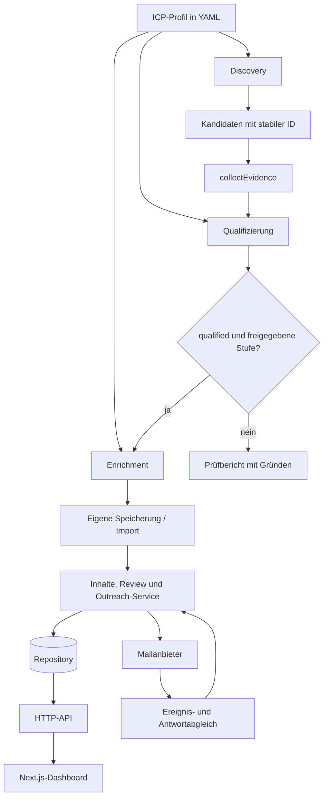

# Architektur

Das Sales Team besteht aus einer profilgesteuerten Recherche-Pipeline, einem zustandsbehafteten Outreach-Service und einem Dashboard. Die Fachregeln zur Zielgruppe liegen im ICP-Profil; technische Anbieter werden über eigene Adapter eingebunden.

## Datenfluss



Die Offline-CLI gibt ihre Ergebnisse als JSON aus. Ein Aufruf von `leads:research` legt nicht automatisch eine Kampagne an und versendet keine Nachricht. Speicherung, individuelle Texte und Versandfreigaben sind eigene Schritte.

## Recherche und Bewertung

| Modul | Verantwortung |
| --- | --- |
| [`src/icp.mjs`](../src/icp.mjs) | YAML laden, Schema und Regelreferenzen prüfen, Suchanfragen und Profilstempel erzeugen. |
| [`src/places.mjs`](../src/places.mjs) | Google-Places-Transport und Such-CLI. |
| [`src/discovery.mjs`](../src/discovery.mjs) | Suchergebnisse als Kandidaten aufbereiten und doppelte IDs zusammenführen. |
| [`src/qualification.mjs`](../src/qualification.mjs) | Belege, Aktualität und Widersprüche prüfen; Kriterien, Signale und Ausschlüsse auswerten. |
| [`src/pipeline.mjs`](../src/pipeline.mjs) | Discovery, Belegerhebung und Enrichment koordinieren; Enrichment-Freigabe erzwingen. |
| [`src/leads.mjs`](../src/leads.mjs) | CLI für lokale Belege, Profilprüfung, Rechercheplan und Ergebnisberichte. |

Ein Beleg enthält einen typisierten Faktwert, eine Quelle, einen Auszug, ein Prüfdatum und eine Vertrauenskennzeichnung. Für zeitbezogene Signale kommt ein Ereignisdatum hinzu. Bestätigte und aktuelle Belege können Regeln erfüllen; widersprüchliche, fehlende oder verworfene Angaben werden nicht stillschweigend zu positiven Fakten.

Die Bedingungen arbeiten mit drei Werten: wahr, falsch und unbekannt. Daraus entstehen die Statuswerte `qualified`, `needs_review`, `not_qualified` und `excluded`. A/B/C ist eine zusätzliche Bewertung gemäß Profil. Eine Stufe allein erlaubt keine Anreicherung: Es müssen `qualified` und eine in `enrichment.eligibleGrades` freigegebene Stufe vorliegen.

Die Pipeline akzeptiert folgende Funktionen:

```js
runPipeline({
  profile,
  discover,        // ({ profile }) -> Kandidaten mit eindeutiger id
  collectEvidence, // ({ candidate, profile, researchPlan }) -> Belege
  enrich,          // ({ candidate, profile, qualification, tasks }) -> Ergebnis
  asOf,            // YYYY-MM-DD
});
```

`collectEvidence` und `enrich` sind Erweiterungspunkte für eigene Dienste. Ohne Belegadapter entstehen keine bestätigten Fakten. Ohne Enrichment-Adapter bleiben geeignete Leads `pending`. Der mitgelieferte `buildEvidenceDossier` erstellt ein Dossier aus bestehenden Belegen und liefert `newExternalResearch: false`.

Das vollständige Profil- und Belegformat steht im [ICP-Handbuch](icp-schema.md).

## Inhalte und Outreach

[`OutreachService`](../src/outreach/service.mjs) erhält ein Repository, einen Mailanbieter und seine Laufzeitkonfiguration. Die Inhaltsbibliothek verwaltet Entwürfe und unveränderliche Versionen für Strategie, Experiment und individuelle Nachricht. Abhängigkeiten halten den zugehörigen Profil-, Bewertungs- und Quellenstand fest.

Bei Aufnahme einer Firma in ein Experiment wird eine Betreffvariante stabil zugeordnet. Die Nachricht enthält einen eingefrorenen Text- und Empfängerstand mit Inhalts-Hash. Eine redaktionell ausgewählte Variante wird gesondert gekennzeichnet, damit sie nicht als zufällige A/B-Zuordnung erscheint.

Vor echtem Versand werden unter anderem folgende Bedingungen geprüft:

- Firma, Kontakt, Bewertung, Kampagne und Experiment gehören zusammen und sind weiterhin geeignet beziehungsweise aktiv.
- Der konkrete Inhalt ist geprüft und stimmt mit seinem eingefrorenen Hash überein.
- Für den Empfänger liegt eine dokumentierte Kontakt- und Anbieterfreigabe vor.
- Firma und Kontakt sind nicht gesperrt; globale Pause, Tageslimit, Zeitfenster und Mindestabstand erlauben den Versuch.
- Die Laufzeitkonfiguration und der Aufruf erlauben tatsächlichen Versand.

Versandversuche werden vor dem Anbieteraufruf reserviert. Ein unklarer Anbieterstatus wird nicht als sichere Nichtzustellung behandelt und nicht blind wiederholt. Der Worker und der reine Ereignisimport sind getrennte Einstiegspunkte; der Ereignisimport erzeugt keine neuen Sendungen.

| Modul | Verantwortung |
| --- | --- |
| [`content.mjs`](../src/outreach/content.mjs), [`profiles.mjs`](../src/outreach/profiles.mjs) | Entwürfe, versionierte Inhalte, Quellenabhängigkeiten und Review. |
| [`experiment.mjs`](../src/outreach/experiment.mjs) | Experimentschema, Varianten und Textdarstellung. |
| [`service.mjs`](../src/outreach/service.mjs), [`ramp.mjs`](../src/outreach/ramp.mjs) | Freigaben, Versandzustände, Ereignisse und Versandgrenzen. |
| [`brevo.mjs`](../src/outreach/brevo.mjs), [`inbound.mjs`](../src/outreach/inbound.mjs) | Mailanbieter und lesender IMAP-Antwortabgleich. |
| [`worker.mjs`](../src/outreach/worker.mjs), [`event-sync.mjs`](../src/outreach/event-sync.mjs) | Steuerbarer Versandablauf und separater Ereignisimport. |
| [`report.mjs`](../src/outreach/report.mjs) | Experimentauswertung mit Beobachtungsfristen und definierten Bezugsgrößen. |

## Datenhaltung und Messung

Der Demo-Start verwendet ein Repository im Arbeitsspeicher und einen simulierten Mailanbieter. Für dauerhafte eigene Daten steht ein explizit zu konfigurierender [Appwrite-REST-Transport](../src/outreach/appwrite-rest.mjs) bereit. Er übernimmt die Repository-Operationen, auf denen Service und API aufbauen.

Das Datenmodell verbindet Auftraggeber, ICP-Versionen, Kampagnen, Rechercheläufe, Firmen, Belege, Bewertungen und Kontakte. Weitere Tabellen speichern Inhaltsversionen, Experimente, Nachrichten, Freigaben, Versandversuche und Ereignisse. Auftraggeberreferenzen werden in den Serviceoperationen gegeneinander geprüft.

[`src/operations/`](../src/operations/) enthält Lauf- und Schrittmessung sowie die Projektionen für Tagesberichte und Dashboard. Instrumentierte Laufzeiten, extern berichtete Zeiten und fehlende Messung bleiben unterscheidbar. Ein erneuter Durchlauf vorhandener Belege misst die Neubewertung, nicht die ursprüngliche Recherche.

Die Auswertung trennt Anbieterannahme, belegten Versand und Zustellung. Wird eine Zustellzeit als Ersatz für einen unbekannten Versandzeitpunkt verwendet, kennzeichnen die Daten diesen Ersatz. Erfasste Antworten, Buchungen und qualifizierte Gespräche haben eigene Ereignisse. Die A/B-Auswertung berücksichtigt abgelaufene Beobachtungsfenster und erklärt keinen automatischen Gewinner.

## API und Dashboard

[`src/outreach/http.mjs`](../src/outreach/http.mjs) stellt die HTTP-API bereit. Das [Dashboard](../apps/dashboard/) lädt Daten serverseitig über diese Schnittstelle. Der Browser erhält keinen Appwrite-Administrationsschlüssel und keinen Mailanbieter-Schlüssel.

Lokal startet die öffentliche Demo ausschließlich auf Loopback: API auf `127.0.0.1:8787`, Dashboard auf `127.0.0.1:3210`. Das Dashboard zeigt Firmenlisten, Filter, Tagesansichten, Details und Nachrichten. Rückmeldungen und Kontaktsperren sind mögliche Bedienaktionen; Versand ist keine Dashboard-Aktion.

Die optionale [`website-quiz.mjs`](../src/integrations/website-quiz.mjs)-Integration nimmt validierte Website-Abschlüsse über einen getrennten Integrationszugang an. Die Website selbst ist nicht enthalten. Eine Korrelationskennung ordnet einen Abschluss zu einer Nachricht zu; sie beweist keine Personenidentität und erteilt keine Versandfreigabe.

Eigene Dienste werden gemäß [Setup](setup.md) eingerichtet. Für einen öffentlichen Dashboard-Betrieb gelten zusätzlich die [Deployment-Schritte](../apps/dashboard/DEPLOYMENT.md).
