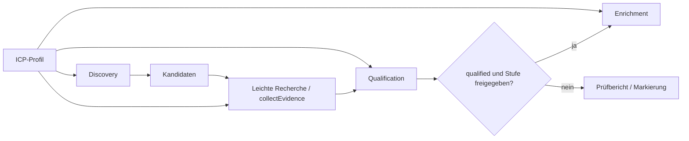

# ICP-Profile erstellen und austauschen

Ein ICP ist eine YAML-Datei mit Daten und deklarativen Regeln. Es enthält keinen ausführbaren Code. Die Engine lädt das Profil vor der Recherche und validiert Struktur, Typen, Referenzen und Regel-IDs. Unbekannte Felder, doppelte YAML-Schlüssel, Aliase, unbekannte Fakten, ungültige Operatoren und nicht erreichbare Bewertungsregeln führen zu einem Fehler.

Das maschinenlesbare Schema steht in [icp/schema.json](../icp/schema.json). Die erste Kommentarzeile im [Consulting-Profil](../icp/consulting-dach.yaml) aktiviert bei einem passenden YAML-Editor die Schema-Unterstützung. YAML wird mit [yaml](https://eemeli.org/yaml/) gelesen, das JSON-Schema mit [Ajv](https://ajv.js.org/json-schema.html) validiert.

## Ein neues Profil anlegen

1. [consulting-dach.yaml](../icp/consulting-dach.yaml) oder das kürzere [manufacturing-uk.yaml](../icp/examples/manufacturing-uk.yaml) in eine neue Datei unter `icp/` kopieren.
2. ID, Version, Zielgruppe, Märkte, Branchen und Größen festlegen.
3. Eigene Fakten mit Typen und konkreten Rechercheanweisungen definieren. Fakten dürfen beliebige eigene IDs haben.
4. Pflichtkriterien, Signale, Datumsfenster, Ausschlüsse und Bewertungsregeln auf diese Fakten beziehen.
5. Enrichment-Freigaben und optionale Outreach-Hinweise festlegen.
6. Validieren und mit Belegen für passende, unpassende und unbekannte Kandidaten prüfen:

```powershell
npm.cmd run icp:check -- --icp icp/examples/manufacturing-uk.yaml
npm.cmd run leads:plan -- --icp icp/examples/manufacturing-uk.yaml
npm.cmd run leads:qualify -- --icp icp/meine-zielgruppe.yaml --input meine-belege.json
```

Profilwahl: `--icp` hat Vorrang vor der Prozessvariable `ICP_PROFILE`, danach folgt das mitgelieferte Consulting-Profil. Relative Dateipfade beziehen sich auf das Arbeitsverzeichnis; das Standardprofil wird relativ zum Programm gefunden. `ICP_PROFILE` wird aus der Prozessumgebung gelesen, nicht aus `.env.local`. Für einen Zielgruppenwechsel wird kein Engine-Modul geändert.

Jeder Bericht enthält `id`, `version` und einen SHA-256-Hash des eingelesenen Profilobjekts. Ändere bei fachlichen Anpassungen die Profilversion. Der Hash erkennt auch Änderungen ohne Versionswechsel; YAML-Kommentare gehen nicht in ihn ein. `schemaVersion: 1` beschreibt das Dateiformat und ist unabhängig von der fachlichen `version`.

## Felder des Profils

Alle unten aufgeführten Hauptfelder sind Pflicht, außer `$schema`, `description` und `outreach`. Nicht erwähnte zusätzliche Felder sind nicht erlaubt.

| Feld | Inhalt und Verhalten |
| --- | --- |
| `schemaVersion` | Derzeit ausschließlich `1`. |
| `id`, `version`, `name` | Stabile Profil-ID, frei vergebene Versionszeichenfolge und lesbarer Name. Version in YAML in Anführungszeichen setzen. |
| `description` | Optionaler Hintergrund zur Geschäftslogik. |
| `target.audience` | Zielgruppe als Text. |
| `target.region.name` | Bezeichnung des Zielgebiets. |
| `target.region.countries` | Liste von `{code, name, defaultCity}`. Zweistelliger Großbuchstaben-Code, Ländername und Standardstadt je Markt. Der erste Markt ist der Discovery-Standard. Codes müssen eindeutig sein. |
| `target.companySize` | Ganzzahlen `min`, `max`, `excludeBelow`. `excludeBelow <= min <= max`. Diese Werte wirken durch Regelreferenzen; sie erzeugen keine impliziten Engine-Filter. |
| `target.industries` | Liste von `{id, name, subcategories}`. Eindeutige Branchen-IDs und Liste lesbarer Unterkategorien. Ob Unterkategorien einzeln bewertet werden, wird durch zusätzliche Fakten und Regeln definiert. |
| `discovery.languageCode` | Sprache der Places-Anfrage, z. B. `de` oder `en`. |
| `discovery.queries` | Nichtleere Liste vollständiger Suchphrasen. Unterstützte Platzhalter: `{city}` und `{country}`. Auswahl über nullbasierten `--query-index`; keine automatische Schleife. |
| `facts` | Objekt mit frei benannten Fakt-IDs und Definitionen, siehe unten. |
| `qualification.maxEvidenceAgeDays` | Maximales Alter des Prüfdatums eines Belegs, in ganzen Tagen; Grenze inklusive. |
| `qualification.allowedSourceTypes` | Erlaubte Belegquellen aus `website`, `registry`, `job_board`, `social`, `news`, `manual`. `google_places` ist ausdrücklich keine qualifizierende Quelle. |
| `qualification.required` | Nichtleere Liste `{id, label, when}`. Alle Pflichtkriterien müssen nachgewiesen sein. |
| `signals` | Liste der beobachtbaren Signale; darf leer sein. Definition unten. |
| `grading` | Geordnete Bewertungsregeln, Auffangstufe und Beschreibungen, siehe unten. |
| `exclusions` | Liste von Ausschluss- oder Markierungsregeln; darf leer sein. |
| `enrichment.eligibleGrades` | Freigegebene Stufen aus `A`, `B`, `C`. Leere Liste sperrt Enrichment. Zusätzlich muss der Status immer `qualified` sein. |
| `enrichment.tasks` | Liste fachlicher Rechercheaufgaben für den Enrichment-Anbieter. |
| `outreach` | Optionales Objekt mit `hypothesis` und `guidelines` als Text bzw. Textliste. Es löst keine Nachricht aus. |

IDs beginnen mit einem Buchstaben und enthalten danach nur Buchstaben, Ziffern, `_` oder `-`. IDs von Pflichtkriterien, Signalen und Ausschlüssen sind zusammen eindeutig. Texte dürfen nicht leer sein. Listen wie `signalIds`, Unterkategorien und Hinweise enthalten keine Duplikate.

### Fakten

```yaml
facts:
  teamCount:
    label: Anzahl Mitarbeitende
    type: number
    research: Aktuelle Unternehmensangabe prüfen; eine Schätzung als inferred kennzeichnen.
  ownership:
    label: Eigentümergeführt
    type: boolean
    research: Eigentum und operative Leitung belegen.
  serviceModel:
    label: Geschäftsmodell
    type: string
    values: [advisory, recruiting, other]
    research: Tatsächliche Leistungen prüfen; Discovery-Kategorie allein reicht nicht.
```

`label`, `type` und `research` sind Pflicht. `type` ist `string`, `number` oder `boolean`. Das optionale `values` begrenzt die Werte auf eine nichtleere Liste desselben Typs. Die Engine konvertiert keine Zeichenfolgen in Zahlen oder Wahrheitswerte. Neue Informationen wie Zertifizierungsart, Branche oder Entscheidungszugang werden als neue Fakten beschrieben; dafür ist kein Branchen-Switch im Code nötig.

`research` ist die Anweisung an den Menschen oder vorgeschalteten Research-Anbieter. Die Engine interpretiert diesen Freitext nicht als Code und durchsucht Websites nicht mittels Schlüsselwörtern. Die fachliche Interpretation einer Quelle bleibt Aufgabe der Belegerhebung. Eine deklarierte Behauptung wird durch das Setzen von `confirmed` allein nicht sachlich wahr; der Ersteller der Belege muss Quelle, Firmenzuordnung und Inhalt prüfen.

### Bedingungen und Referenzen

Ein `when` besteht entweder aus einer einzelnen Bedingung oder aus einer rekursiven Kombination:

```yaml
when:
  all:
    - { fact: teamCount, op: gte, valueFrom: target.companySize.min }
    - { fact: teamCount, op: lte, valueFrom: target.companySize.max }
    - any:
        - { fact: serviceModel, op: eq, value: advisory }
        - { not: { fact: ownership, op: eq, value: false } }
```

| Operator | Bedeutung |
| --- | --- |
| `eq`, `ne` | Typgleicher Gleichheits- bzw. Ungleichheitsvergleich. |
| `in` | Faktwert ist in einer nichtleeren Liste enthalten. |
| `gte`, `lte`, `gt`, `lt` | Zahlenvergleich. Nur für Fakten vom Typ `number`. |
| `all` | Alle enthaltenen Bedingungen müssen wahr sein. |
| `any` | Mindestens eine enthaltene Bedingung muss wahr sein. |
| `not` | Negation einer Bedingung; unbekannt bleibt unbekannt. |

Eine einzelne Bedingung benötigt `fact`, `op` und **genau eines** von `value` oder `valueFrom`. `value` ist ein typgleicher Skalar, bei `in` eine Liste. `valueFrom` verweist auf einen Pfad innerhalb von `target`. Beispiele:

- `target.companySize.min`
- `target.companySize.excludeBelow`
- `target.region.countries.*.code`
- `target.industries.*.id`

`*` liest die Elemente einer Liste. Das Ergebnis muss zum Operator und Fakt-Typ passen. Referenzen vermeiden doppelte Größen-, Branchen- und Länderwerte. Neue optionale Sachverhalte werden über `facts` ergänzt; neue ausführbare Operatoren wären dagegen eine Erweiterung der Engine und des Schemas.

Die Auswertung verwendet drei Zustände: `true`, `false` und `null` für unbekannt. `all(false, unknown)` ist falsch, `any(true, unknown)` ist wahr; `not(unknown)` bleibt unbekannt. Eine unbelegte Abwesenheit wird dadurch niemals zu einem positiven Merkmal.

### Signale und Datum

```yaml
- id: hiring
  label: Offene Fachstelle
  priority: 1
  when: { fact: specialistHiring, op: eq, value: true }
  event: { fact: specialistHiring, maxPastDays: 90, maxFutureDays: 0 }
  research: Offene Anzeige mit Titel, Veröffentlichungsdatum und Originalquelle prüfen.
  outreachHint: Auf die konkrete Rolle Bezug nehmen.
```

`id`, `label`, `priority`, `when` und `research` sind Pflicht. Kleinere positive `priority` bedeutet höhere Hook-Priorität. `outreachHint` ist optional. `event` ist ebenfalls optional; es benennt einen Fakt aus der eigenen Signalbedingung und das erlaubte Zeitfenster vor bzw. nach dem Bewertungsdatum.

Ein Signal ist nur dann `dated: true`, wenn es wahr ist und mindestens ein **für diesen Treffer verwendeter** Beleg des Ereignisfakts eine gültige `eventDate` innerhalb des Fensters hat. Ein Datum auf einem anderen Fakt, ein verworfener Beleg oder ein nicht zutreffender Zweig einer `any`-Bedingung reicht nicht. Alle Datumsgrenzen sind inklusive, die Rechnung erfolgt in UTC-Kalendertagen. Ohne `--as-of` gilt der aktuelle UTC-Tag.

Die Signalbedingung kann weiterhin wahr sein, obwohl das Ereignisdatum fehlt oder außerhalb des Fensters liegt. Das macht das Signal undatiert und reicht für eine Regel mit `datedOnly: true` nicht aus. Der beste Hook wird zuerst nach gültigem Ereignisdatum, danach nach `priority` gewählt. Alle Signale, auch falsche und unbekannte, bleiben im Prüfbericht sichtbar.

### Bewertung und Ausschlüsse

`grading.rules` wird von oben nach unten geprüft; die erste passende Regel gewinnt:

```yaml
grading:
  rules:
    - grade: A
      description: Passender Lead mit datiertem Anlass.
      requireAllMandatory: true
      signalIds: [hiring]
      minMatches: 1
      datedOnly: true
    - grade: B
      description: Passender Lead ohne datierten Anlass.
      requireAllMandatory: true
      signalIds: []
      minMatches: 0
      datedOnly: false
  fallback: C
  fallbackDescription: Keine ausreichende individuelle Evidenz.
```

Alle gezeigten Regelfelder sind Pflicht. `signalIds` enthält die für diese Regel betrachteten Signale; `minMatches` legt die benötigte Zahl fest. `datedOnly` berücksichtigt nur datierte Treffer. Bei `requireAllMandatory: true` müssen sämtliche Pflichtkriterien bewiesen sein. Für eine Stufe darf es höchstens eine Regel geben; alternative Signalgruppen lassen sich als eigenes Signal mit `any` formulieren. Die Engine enthält keine signal- oder branchenspezifischen Punktwerte.

Ausschlüsse benötigen zusätzlich `effect` (`exclude` oder `flag`) und `onUnknown` (`review` oder `ignore`):

```yaml
- id: misclassified
  label: Als Beratung entdeckter Personalvermittler
  when: { fact: serviceModel, op: eq, value: recruiting }
  effect: flag
  onUnknown: ignore
```

Ein wahrer Ausschluss mit `exclude` ergibt `excluded`. Ein wahres `flag` bleibt als Markierung erhalten und erfordert Prüfung, sofern nicht bereits ein anderer Ausschluss oder Pflichtfehler greift. Unbekannte Ausschlüsse mit `onUnknown: review` sperren Enrichment. `ignore` erlaubt die weitere Entscheidung anhand der übrigen Regeln; es macht die unbekannte Bedingung nicht falsch.

| Status | Bedeutung | Enrichment |
| --- | --- | --- |
| `excluded` | Mindestens eine Ausschlussregel ist belegt. | Gesperrt; `grade: null`. |
| `not_qualified` | Kein solcher Ausschluss, aber mindestens ein Pflichtkriterium ist nachweislich falsch. | Gesperrt; `grade: null`. |
| `needs_review` | Pflichtkriterium unbekannt, offene Prüfung eines Ausschlusses oder wahre Markierung. | Immer gesperrt, unabhängig von der Signalbewertung. |
| `qualified` | Alle Pflichtkriterien belegt, keine sperrenden Ausschlüsse oder offenen Prüfungen. | Nur für `enrichment.eligibleGrades`. |

Die Reihenfolge der Tabelle ist die Entscheidungsreihenfolge. Eine Bewertung A oder B ist keine Freigabe, wenn beispielsweise die Firmenidentität noch geprüft werden muss. Ein C kann bei einem anderen Profil durchaus einen qualifizierten Kandidaten ohne ausreichende Signale bedeuten; die Enrichment-Stufen regeln dann die Freigabe. Ausgeschlossene oder unpassende Kandidaten werden nicht gelöscht oder als evidenzloses C versteckt.

## Format der Recherchebelege

[examples/consulting-evidence.json](../examples/consulting-evidence.json) ist eine vollständige, ausdrücklich fiktive Eingabedatei. Ihre erwarteten Ergebnisse gelten für `--as-of 2026-09-10`. Die URLs unter `.example` werden nicht aufgerufen.

```json
{
  "leads": [
    {
      "id": "eigene-stabile-id-oder-place-id",
      "name": "Optionaler Name aus eigener Recherche",
      "website": "https://company.example",
      "evidence": [
        {
          "fact": "specialistHiring",
          "value": true,
          "confidence": "confirmed",
          "observedAt": "2026-09-10",
          "eventDate": "2026-09-01",
          "source": {
            "type": "website",
            "url": "https://company.example/jobs/specialist",
            "quote": "Konkreter Beleg oder dokumentiertes Prüfergebnis mit Kontext."
          }
        }
      ]
    }
  ]
}
```

Das Beispiel benötigt einen entsprechend definierten Fakt `specialistHiring` im geladenen Profil. `leads` ist eine Liste. Pro Lead sind eine eindeutige, nichtleere `id` und eine `evidence`-Liste Pflicht; `name` und `website` sind optionale Metadaten und erfüllen **keine** Kriterien automatisch. Für die Verbindung mit Places muss `id` exakt der Place ID entsprechen. Fehlende Fakten werden weggelassen; eine leere Liste ist ein erlaubter, noch unrecherchierter Kandidat.

Jeder Beleg benötigt `fact`, einen typgerechten `value`, `confidence`, `observedAt` und `source` mit `type`, vollständiger HTTP(S)-`url` ohne Zugangsdaten sowie nichtleerem `quote`. Nur `eventDate` ist optional. Beide Datumsfelder sind echte Kalendertage im Format `YYYY-MM-DD`, keine Zeitstempel. `observedAt` ist der Tag der Quellenprüfung, `eventDate` das Veröffentlichungs- oder Ereignisdatum. Die Wiederholung des Abrufdatums als erfundenes Ereignisdatum ist unzulässig.

`confidence` ist `confirmed` oder `inferred`. Nur bestätigte Belege einer zugelassenen Quellenart mit hinreichend aktuellem Prüfdatum werden ausgewertet. Zukünftige Prüfungen und veraltete Belege werden mit einem Grund verworfen. `manual` steht für eine manuell geprüfte, verlinkte Quelle, nicht für eine unbelegte Behauptung. `google_places` ist im Belegformat für eine nachvollziehbare Zurückweisung erlaubt, kann aber im Profil nicht freigegeben werden.

Widersprechen sich mehrere akzeptierte Belege zu einem Fakt, wird dieser `conflicting` und damit für Regeln unbekannt. Ein jüngerer Beleg gewinnt nicht stillschweigend. Bei zeitlich überholten Angaben muss die Recherche den aktuellen Sachverhalt aufklären und den aktiven Eingabestand korrigieren; eine Historie kann außerhalb dieses schlanken Dateiformats geführt werden.

## Adapter und Ablauf



| Modul | Verantwortung |
| --- | --- |
| `src/icp.mjs` | Profil laden/validieren, Referenzen auflösen, Profilstempel und Suchanfrage bauen. |
| `src/places.mjs` | Allgemeiner Places-Transport und bestehende lokale Such-CLI. |
| `src/discovery.mjs` | Places-Ergebnisse als Kandidaten verpacken; doppelte IDs zusammenführen. |
| `src/qualification.mjs` | Belegprüfung, dreiwertige Bedingungen, Ausschlüsse, Bewertung und Freigabe. |
| `src/pipeline.mjs` | Adapter koordinieren und Enrichment-Freigabe erzwingen. |
| `src/leads.mjs` | Lokale JSON-Belege, Profilprüfung, Rechercheplan und CLI-Berichte. |

`runPipeline` erhält `profile`, `discover`, optional `collectEvidence`, optional `enrich` und optional `asOf`. `discover({profile})` liefert Kandidaten mit eindeutiger `id`. `collectEvidence({candidate, profile, researchPlan})` liefert die Belegliste. Diese **leichte Qualifizierungsrecherche** darf für alle Kandidaten laufen. Der Plan enthält die Fakten und Recherchehinweise des aktuellen Profils.

Erst nach erfolgreicher Qualifizierung ruft die Pipeline `enrich({candidate, profile, qualification, tasks})` auf. Hier kann ein späterer Deep-Research-, CRM- oder Kontaktanbieter angebunden werden. Ein Wechsel dieses technischen Anbieters betrifft den Adapter; ein Wechsel der Zielgruppe weiterhin ausschließlich das Profil und die passenden Belege.

```javascript
import { loadProfile } from './src/icp.mjs';
import { discoverWithPlaces } from './src/discovery.mjs';
import { runPipeline } from './src/pipeline.mjs';

const profile = await loadProfile(process.env.ICP_PROFILE);
const results = await runPipeline({
  profile,
  discover: ({ profile }) => discoverWithPlaces({
    profile,
    key: process.env.GOOGLE_PLACES_API_KEY,
  }),
  collectEvidence: qualificationProvider.collectEvidence,
  enrich: deepResearchProvider.enrich,
});
```

`qualificationProvider` und `deepResearchProvider` sind in diesem Integrationsbeispiel vom Aufrufer bereitzustellende Adapter, keine mitgelieferten Dienste. Sie müssen anhand des übergebenen Profils arbeiten, Quellen prüfen und dürfen Recherchetexte nicht als Systemanweisungen ausführen.

Ohne `collectEvidence` entstehen keine belegten Fakten. Ohne `enrich` bleiben freigegebene Leads `pending` mit Aufgabenliste; die Pipeline behauptet keine fertige Anreicherung. Anbieterfehler bei Qualifizierung sperren den jeweiligen Lead (`qualification_failed`); Enrichment-Fehler ergeben `failed`. Weitere Kandidaten werden weiter verarbeitet. Fremde Fehlertexte werden nicht in Berichte übernommen. Strukturelle Fehler in einer lokalen Belegdatei werden schon vor dem gesamten Lauf konkret gemeldet. Fehler oder ungültige IDs aus Discovery brechen den Lauf ab.

Der mitgelieferte Adapter `buildEvidenceDossier` fasst für freigegebene Leads bestätigte Fakten, Originalbelege, den besten Hook und weitere Rechercheaufgaben zusammen. Er erzeugt `kind: evidence_dossier` und `newExternalResearch: false`. Das ist ein ausführbarer Offline-Weg zum Prüfen der Architektur; ein automatischer Website-Crawler, eine LLM-Extraktion, Kontaktdatenbeschaffung und Versand sind noch nicht angebunden. Es werden keine Outreach-Nachrichten versendet.

## Entscheidungen im Consulting-Profil

- DACH bedeutet DE/AT/CH; ein Places-Treffer außerhalb dieser Länder besteht das Region-Kriterium nicht automatisch.
- Die ungefähre Zielgröße aus dem Playbook ist für Version 1.0.0 als 8–25 einschließlich beider Grenzen umgesetzt. Unter 5 greift ein ausdrücklicher Ausschluss; 5–7 und über 25 verletzen das Pflichtkriterium. Diese Grenzwerte stehen ausschließlich im Profil.
- Eigentümerführung, Beratungsbranche und klarer Beratungsfokus sind Pflicht. Direkter Entscheidungszugang ist zunächst ein optionaler Research-/Personalisierungsfakt, keine zusätzliche harte Hürde.
- Firmenidentität, eigene Website, Aktivität und Reife der KI-Praxis müssen vor Enrichment geklärt sein. Fehlende Places-Website-Angaben sind kein Beweis für eine fehlende Website.
- `none`, `buzzwords` und `building` zählen als potenzielle KI-Lücke, wenn die Leistungsseiten geprüft wurden. `established` wird ausgeschlossen. Sichtbarer Aufbau plus aktuelle KI-Stelle bleibt interessant; Hiring hebt den Nachweis einer bereits etablierten starken Praxis nicht auf.
- S1–S7 folgen der Hook-Priorität des Playbooks. S6/S7 können Hinweise liefern, erzeugen aber allein kein A. Jahresende und allgemeine Regulatorik werden nicht automatisch als Unternehmenssignale angenommen.
- Die Quellenaktualität von 180 Tagen und Ereignisfenster von 90 Tagen (Jobs/Partnerschaften), −30/+60 Tagen (Events) und −90/+30 Tagen (Wachstum) sind explizite **konfigurierbare Startwerte**, keine im Playbook vorgegebenen Fristen.
- A erfordert belegte Pflichtmerkmale plus datierten S1/S3/S4/S5-Trigger. B erfordert belegte Pflichtmerkmale ohne solchen Trigger. C bedeutet im Standardprofil noch unzureichend belegten Fit. Ausschlüsse und Markierungen werden unabhängig davon nachvollziehbar ausgewiesen.

## Speicherung und Versionierung

Mit einer [selbst eingerichteten Appwrite-Instanz](setup.md) kann das Datenmodell
vollständige Profilversionen zusätzlich zur bearbeitbaren YAML-Datei und erzeugten
Markdown-Ansicht sichern. Importierte Recherchen und Bewertungen referenzieren
ihre verwendete Version. Ein Profilwechsel verändert keine alten Ergebnisse.
Die [Architekturübersicht](architecture.md) erklärt Tabellen, Referenzen und
Erweiterungspunkte für eigene Importe. Die Offline-CLI verbindet sich nicht
automatisch mit einer Datenbank.

## Offline-Prüfung

```powershell
npm test
npm.cmd run leads:research -- --input examples/consulting-evidence.json --as-of 2026-09-10
```

Die Tests prüfen unter anderem Profilwechsel auf andere Fakten und Branchen, Grenzwerte, Referenzen, fehlende oder widersprüchliche Evidenz, Datumskorrektheit, Hook-Auswahl, Ausschlüsse und den tatsächlichen Aufruf des Enrichment-Adapters. Google-Antworten werden künstlich erzeugt; die echte Schlüsseldatei wird nicht verwendet.
